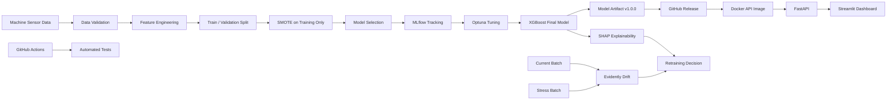

# Predictive Maintenance MLOps

[](https://github.com/rohithap0819/predictive-maintenance-mlops/actions/workflows/ci.yml)
[](https://github.com/rohithap0819/predictive-maintenance-mlops)
[](https://predictive-maintenance-mlops-1.onrender.com)
[](https://predictive-maintenance-mlops-n716.onrender.com/docs)
[](https://www.docker.com/)
[](https://www.python.org/)

An end-to-end **Machine Learning Operations (MLOps)** project for multiclass predictive maintenance. The system takes industrial machine sensor readings, predicts machine failure modes, exposes predictions through a FastAPI service, visualizes them through a Streamlit dashboard, tracks experiments with MLflow, tunes the final model with Optuna, monitors production drift with Evidently, explains predictions with SHAP, packages the model as a versioned artifact, containerizes the application with Docker, validates changes with automated tests, and deploys the application to Render.

---

# 🚀 Live Demo

### Streamlit Dashboard

**https://predictive-maintenance-mlops-1.onrender.com**

Use the dashboard to:

- Enter machine sensor readings
- Generate failure predictions
- Inspect class probabilities
- View engineered features
- Inspect model information
- Review current and stress drift reports
- View SHAP explainability results

### FastAPI

**https://predictive-maintenance-mlops-n716.onrender.com**

### Interactive API Documentation

**https://predictive-maintenance-mlops-n716.onrender.com/docs**

The FastAPI service provides:

- `GET /health`
- `GET /model-info`
- `POST /predict`
- `GET /`

> The Render free tier may spin services down after inactivity, so the first request after a period of inactivity can take longer than subsequent requests.

---

# 📌 Project Overview

A heavy-equipment manufacturer wants to reduce unplanned machine downtime.

Each machine produces sensor measurements such as temperature, rotational speed, torque, and tool wear. The goal is to classify whether a machine is operating normally or is heading toward one of four failure modes.

### Failure classes

| Class ID | Failure Type |
|---:|---|
| 0 | No Failure |
| 1 | TWF |
| 2 | HDF |
| 3 | PWF |
| 4 | OSF |

The project follows the complete MLOps workflow:

```text
Validate
   ↓
Train
   ↓
Track
   ↓
Tune
   ↓
Monitor
   ↓
Explain
   ↓
Decide
```

---

# 🏗️ Architecture



---

# 🔄 End-to-End Deployment Flow

```text
Developer
   │
   ▼
GitHub Repository
   │
   ├── GitHub Actions
   │       └── pytest
   │
   ├── Model Release v1.0.0
   │       └── predictive-maintenance-model.zip
   │
   ▼
Docker Build
   │
   ├── FastAPI container
   │       └── Downloads model artifact
   │
   └── Streamlit container
   │
   ▼
Render
   │
   ├── FastAPI Web Service
   │       └── XGBoost prediction API
   │
   └── Streamlit Web Service
           └── Interactive dashboard
```

---

# 📂 Dataset

The project uses three datasets with different operational roles.

| Dataset | Role |
|---|---|
| `train.csv` | Historical labelled baseline used for training and validation |
| `current.csv` | Stable post-deployment production batch |
| `stress.csv` | Valid but distributionally shifted heavy-load batch |

The important MLOps distinction is:

```text
Schema validity ≠ Distribution stability
```

The stress dataset is intentionally valid data that can still exhibit meaningful drift.

### Raw columns

```text
Type
Air temperature
Process temperature
Rotational speed
Torque
Tool wear
Failure_Type
```

---

# 🔧 Feature Engineering

Two domain-inspired features are created.

### Mechanical Power

```text
Power_W = Torque × (2π × Rotational Speed / 60)
```

### Temperature Difference

```text
Temp_diff = Process temperature - Air temperature
```

The final feature set used by the model includes:

```text
Type_Code
Air temperature
Process temperature
Rotational speed
Torque
Tool wear
Power_W
Temp_diff
```

---

# ✅ Data Validation

Pandera is used to validate the raw datasets before modeling.

Validation covers:

- Required columns
- Data types
- Machine type categories
- Failure class values
- Validation of `train.csv`
- Validation of `current.csv`
- Validation of `stress.csv`

The stress batch is expected to remain schema-valid while showing distributional drift.

---

# ⚖️ Class Imbalance

The target is highly imbalanced.

Training class counts include:

| Failure Type | Real Training Samples |
|---|---:|
| No Failure | 6,762 |
| TWF | 30 |
| HDF | 76 |
| PWF | 56 |
| OSF | 69 |

This imbalance makes plain accuracy an unsuitable primary model-selection metric.

### Imbalance strategy

1. Stratified 80/20 train-validation split
2. SMOTE applied **only to the training split**
3. `k_neighbors=3`
4. Validation set remains untouched

This avoids validation leakage while improving representation of minority classes during training.

---

# 🤖 Model Selection

Four candidate classifiers are trained and tracked with MLflow:

- Logistic Regression
- Random Forest
- XGBoost
- LightGBM

The primary evaluation metric is:

```text
Macro F1
```

Macro F1 is used because it gives equal importance to each failure class instead of allowing the majority class to dominate the evaluation.

## Baseline comparison

| Model | Macro F1 | Accuracy |
|---|---:|---:|
| XGBoost | 0.7500 | 0.9850 |
| Random Forest | 0.7355 | 0.9850 |
| LightGBM | 0.7296 | 0.9843 |
| Logistic Regression | 0.5312 | 0.9042 |

XGBoost was selected as the strongest baseline candidate by macro F1 and subsequently tuned with Optuna.

> Accuracy remains useful as a secondary metric, but it is not the primary selection criterion because the problem contains severe class imbalance.

---

# 🎯 Hyperparameter Optimization

Optuna is used to tune the XGBoost model.

The optimization objective is:

```text
Validation Macro F1
```

The study searches parameters including:

- `n_estimators`
- `max_depth`
- `learning_rate`
- `min_child_weight`
- `subsample`
- `colsample_bytree`
- `gamma`
- `reg_alpha`
- `reg_lambda`

The tuned model is logged to MLflow and registered as the final model.

---

# 🧪 MLflow Experiment Tracking

MLflow is used for:

- Experiment tracking
- Parameter logging
- Metric logging
- Per-class F1 logging
- Model artifact logging
- Model registration

The training workflow records:

```text
Model parameters
Validation metrics
Macro F1
Weighted F1
Accuracy
Per-class F1
Model artifacts
```

---

# 📦 Model Versioning

The deployable model is packaged as:

```text
predictive-maintenance-model.zip
```

The package contains:

```text
best_model.pkl
type_encoder.pkl
best_model_metadata.pkl
```

The first production artifact is versioned as:

```text
v1.0.0
```

GitHub Release:

**https://github.com/rohithap0819/predictive-maintenance-mlops/releases/tag/v1.0.0**

The trained `.pkl` files and local artifact ZIP are intentionally excluded from Git.

Instead:

```text
Training
   ↓
Model artifacts
   ↓
GitHub Release v1.0.0
   ↓
Docker build downloads artifact
   ↓
FastAPI loads model
```

This keeps the Git repository focused on source code while making the deployed model reproducible and versioned.

---

# 🌐 FastAPI

The prediction API is built with FastAPI.

### Endpoints

| Method | Endpoint | Purpose |
|---|---|---|
| `GET` | `/health` | Service health check |
| `GET` | `/model-info` | Model metadata |
| `POST` | `/predict` | Machine failure prediction |
| `GET` | `/` | API root |

### Example request

```json
{
  "type": "L",
  "air_temperature": 300.0,
  "process_temperature": 315.0,
  "rotational_speed": 1200,
  "torque": 70.0,
  "tool_wear": 240
}
```

### Example prediction response

```json
{
  "prediction": "OSF",
  "class_id": 4,
  "probabilities": {
    "No Failure": 0.000078,
    "TWF": 0.000042,
    "HDF": 0.000002,
    "PWF": 0.000003,
    "OSF": 0.999876
  },
  "engineered_features": {
    "Power_W": 8796.459,
    "Temp_diff": 15.0
  }
}
```

---

# 📊 Streamlit Dashboard

The Streamlit dashboard provides four sections.

## 1. Prediction

Users can enter:

- Machine type
- Air temperature
- Process temperature
- Rotational speed
- Torque
- Tool wear

The dashboard sends the input to FastAPI and displays:

- Predicted failure class
- Class ID
- Failure probabilities
- Engineered features
- Raw API response

## 2. Model Information

Displays model information retrieved from the FastAPI service.

## 3. Drift Monitoring

Provides:

- Current batch Evidently report
- Stress batch Evidently report
- Feature-level drift results

## 4. Explainability

Provides:

- SHAP feature importance by failure class
- SHAP feature summary table

---

# 📈 Drift Monitoring

Evidently is used to monitor production distribution changes.

Two post-deployment scenarios are evaluated:

### Current batch

Represents a normal incoming production batch and is expected to remain relatively stable compared with training data.

### Stress batch

Represents a heavy-load production scenario and is intentionally distributionally shifted.

The monitoring workflow produces:

```text
reports/drift_current.html
reports/drift_current_features.csv

reports/drift_stress.html
reports/drift_stress_features.csv
```

The project treats drift as a production diagnosis problem rather than simply trying to maximize stress-batch accuracy.

---

# 🧠 SHAP Explainability

SHAP is used to interpret the final multiclass tree model.

The project produces:

```text
reports/shap_per_class.png
reports/shap_feature_summary.csv
```

Explainability is performed **per failure class**, rather than collapsing the multiclass model into one global feature ranking.

The goal is to understand:

```text
Which features influence TWF?
Which features influence HDF?
Which features influence PWF?
Which features influence OSF?
```

The results are used alongside drift evidence to support retraining decisions.

---

# 🔁 Retraining Decision

The MLOps workflow connects monitoring to an operational decision.

The decision logic considers:

```text
Data drift
+
Feature-level evidence
+
SHAP insights
+
Failure-mode behavior
=
Retraining decision
```

The stress batch is designed to demonstrate why a model can remain technically valid while becoming less trustworthy under a changed operating distribution.

---

# 🐳 Docker

The application is containerized using two Docker images.

### FastAPI

```text
Dockerfile.api
```

### Streamlit

```text
Dockerfile.dashboard
```

### Docker Compose

```text
docker-compose.yml
```

Run locally:

```bash
docker compose build
docker compose up -d
```

Local services:

```text
Streamlit
http://localhost:8501

FastAPI
http://localhost:8000

FastAPI Swagger
http://localhost:8000/docs
```

Stop services:

```bash
docker compose down
```

The FastAPI Docker image downloads the versioned model artifact from GitHub Release `v1.0.0` during the image build.

---

# 🧪 Automated Testing

Pytest is used for automated validation.

Current tests cover:

- API health endpoint
- Model information endpoint
- Prediction endpoint
- Feature engineering

Run locally:

```bash
pytest -v
```

Expected result:

```text
4 passed
```

The CI test environment uses a lightweight test model and does not require committing production model artifacts to the repository.

---

# ⚙️ GitHub Actions CI

GitHub Actions automatically runs tests on:

```text
push → main
pull_request → main
```

Workflow:

```text
GitHub Push
    ↓
Checkout Repository
    ↓
Set Up Python 3.12
    ↓
Install Dependencies
    ↓
Run pytest
    ↓
CI Result
```

Workflow file:

```text
.github/workflows/ci.yml
```

---

# ☁️ Deployment

The application is deployed to Render using Docker-based Web Services.

### Service 1 — FastAPI

```text
predictive-maintenance-api
```

Public API:

```text
https://predictive-maintenance-mlops-n716.onrender.com
```

Swagger:

```text
https://predictive-maintenance-mlops-n716.onrender.com/docs
```

### Service 2 — Streamlit

```text
predictive-maintenance-dashboard
```

Public dashboard:

```text
https://predictive-maintenance-mlops-1.onrender.com
```

### Deployment architecture

```text
                    Render
                      │
          ┌───────────┴───────────┐
          │                       │
          ▼                       ▼
   Streamlit Service       FastAPI Service
          │                       │
          │ HTTP                  │
          └──────────►────────────┘
                                  │
                                  ▼
                           XGBoost Model
                             v1.0.0
```

The Streamlit service communicates with FastAPI using:

```text
API_URL
```

The deployed FastAPI service uses:

```text
TESTING=0
```

---

# 🗂️ Project Structure

```text
predictive-maintenance-mlops/
│
├── .github/
│   └── workflows/
│       └── ci.yml
│
├── api/
│   ├── __init__.py
│   └── main.py
│
├── dashboard/
│   └── app.py
│
├── data/
│   ├── train.csv
│   ├── current.csv
│   └── stress.csv
│
├── models/
│   ├── best_model.pkl
│   ├── type_encoder.pkl
│   └── best_model_metadata.pkl
│
├── notebooks/
│   └── MLOps_Assignment_Completed.ipynb
│
├── reports/
│   ├── drift_current.html
│   ├── drift_current_features.csv
│   ├── drift_stress.html
│   ├── drift_stress_features.csv
│   ├── model_comparison.csv
│   ├── shap_feature_summary.csv
│   └── shap_per_class.png
│
├── scripts/
│   └── package_model.py
│
├── src/
│   ├── data_validation.py
│   ├── preprocessing.py
│   ├── train.py
│   ├── evaluate.py
│   ├── drift.py
│   ├── explain.py
│   └── retrain.py
│
├── tests/
│   ├── test_api.py
│   └── test_preprocessing.py
│
├── .dockerignore
├── .gitignore
├── Dockerfile.api
├── Dockerfile.dashboard
├── docker-compose.yml
├── pytest.ini
├── readme.md
└── requirements.txt
```

> Local/generated directories such as `.venv/`, `data/`, `models/`, `mlruns/`, `mlflow.db`, `artifacts/`, and test caches are excluded from Git where appropriate.

---

# 🛠️ Local Setup

## 1. Clone the repository

```bash
git clone https://github.com/rohithap0819/predictive-maintenance-mlops.git
cd predictive-maintenance-mlops
```

## 2. Create a virtual environment

Windows:

```cmd
py -3.12 -m venv .venv
.venv\Scripts\activate
```

## 3. Install dependencies

```bash
python -m pip install --upgrade pip
pip install -r requirements.txt
```

## 4. Run tests

```bash
pytest -v
```

## 5. Start FastAPI

```bash
python -m uvicorn api.main:app --reload
```

Open:

```text
http://localhost:8000/docs
```

## 6. Start Streamlit

In another terminal:

```bash
streamlit run dashboard/app.py
```

Open:

```text
http://localhost:8501
```

---

# 🐳 Run Entire Application with Docker

Build:

```bash
docker compose build
```

Start:

```bash
docker compose up -d
```

Check:

```bash
docker compose ps
```

View logs:

```bash
docker compose logs api
docker compose logs dashboard
```

Stop:

```bash
docker compose down
```

---

# 📦 Package a New Model Artifact

After producing new model files in `models/`:

```bash
python scripts/package_model.py
```

This creates:

```text
artifacts/predictive-maintenance-model.zip
```

The artifact is intentionally ignored by Git and can be uploaded to a versioned GitHub Release.

Example release versions:

```text
v1.0.0
v1.1.0
v2.0.0
```

This separates application source-code versioning from model-artifact versioning.

---

# 📊 Key Engineering Lessons

### 1. Accuracy can be misleading

With severe class imbalance, a model can achieve high accuracy while performing poorly on rare failure classes.

### 2. SMOTE must be applied carefully

The correct order is:

```text
Train/Validation Split
        ↓
SMOTE on Training Only
        ↓
Model Training
        ↓
Original Validation Evaluation
```

### 3. Valid data can still be drifted data

Pandera verifies structural/data validity.

Evidently investigates distributional change.

These solve different problems.

### 4. Rare failure data remains a challenge

TWF has very few real training examples. SMOTE can rebalance the training data, but it cannot create the full real-world diversity of a rare failure mode.

### 5. Explainability should lead to action

SHAP is not included only as a visualization. Feature-level explanations are considered alongside drift evidence when deciding whether retraining may be necessary.

---

# 🔮 Future Improvements

Potential next iterations include:

- Scheduled model retraining
- Automated model promotion through a registry
- Cloud object storage for artifacts
- Secret management
- Authentication for the prediction API
- API request logging
- Model performance monitoring with labelled production outcomes
- Automated drift-triggered retraining workflows
- Canary or blue/green model deployment
- Infrastructure as Code
- Container image vulnerability scanning
- Separate staging and production environments

---

# 🧰 Technology Stack

| Area | Technology |
|---|---|
| Language | Python 3.12 |
| Data Processing | Pandas, NumPy |
| Validation | Pandera |
| ML | Scikit-learn, XGBoost, LightGBM |
| Imbalance Handling | imbalanced-learn / SMOTE |
| Experiment Tracking | MLflow |
| Hyperparameter Tuning | Optuna |
| Drift Monitoring | Evidently |
| Explainability | SHAP |
| API | FastAPI |
| Dashboard | Streamlit |
| Containerization | Docker, Docker Compose |
| Testing | Pytest |
| CI | GitHub Actions |
| Model Versioning | GitHub Releases |
| Deployment | Render |
| Version Control | Git / GitHub |

---

# 📈 Project Outcome

This project demonstrates an end-to-end predictive maintenance system rather than only a notebook-based classifier.

It covers:

```text
Data Validation
       ↓
EDA & Feature Engineering
       ↓
Class-Imbalance Handling
       ↓
Model Comparison
       ↓
MLflow Tracking
       ↓
Optuna Tuning
       ↓
Model Registration
       ↓
Model Artifact Versioning
       ↓
FastAPI Serving
       ↓
Streamlit Dashboard
       ↓
Evidently Drift Monitoring
       ↓
SHAP Explainability
       ↓
Automated Testing
       ↓
GitHub Actions CI
       ↓
Docker
       ↓
Render Deployment
```

The project demonstrates the complete MLOps lifecycle:

> **Validate → Train → Track → Tune → Monitor → Explain → Decide → Deploy**

---

# 🔗 Links

**GitHub Repository**  
https://github.com/rohithap0819/predictive-maintenance-mlops

**Live Streamlit Dashboard**  
https://predictive-maintenance-mlops-1.onrender.com

**Live FastAPI**  
https://predictive-maintenance-mlops-n716.onrender.com

**FastAPI Swagger Documentation**  
https://predictive-maintenance-mlops-n716.onrender.com/docs

**Model Release v1.0.0**  
https://github.com/rohithap0819/predictive-maintenance-mlops/releases/tag/v1.0.0

---

## 👤 Author

**Rohith AP**

GitHub:  
https://github.com/rohithap0819

---

## 📄 Assignment Context

The original assignment focuses on a local predictive-maintenance MLOps workflow covering data validation, model selection, experiment tracking, Optuna tuning, Evidently monitoring, SHAP explainability, and evidence-based retraining decisions. This repository extends that workflow with API serving, an interactive dashboard, Docker, automated testing, CI, versioned model artifacts, and public deployment.
